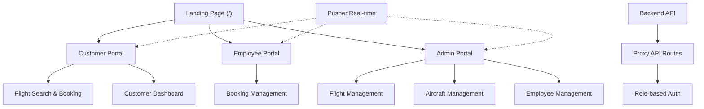

# SkyPhoenix Flight Booking System - Technical Documentation

## 1. Project Overview

### Purpose and Core Functionality

SkyPhoenix is a comprehensive flight booking and management system that provides a premium, safe, and high-quality flight experience. The application serves as a multi-portal platform enabling customers to search and book flights, employees to manage bookings, and administrators to oversee the entire operation.

### Problem Statement

The application solves the need for a centralized, role-based flight management platform that:

* Allows customers to browse available flights and make real-time bookings with multiple passengers
* Enables employees to view and manage all customer bookings efficiently
* Provides administrators with comprehensive control over flights, aircraft, and employee management
* Delivers real-time notifications for booking confirmations and status updates using WebSocket technology

## 2. Architecture

### High-Level Component Architecture

The application follows Next.js 16's App Router architecture with a clear separation between three distinct portals.



### Role-Based Portal Breakdown

**Customer Portal (`/customer`)**

* Flight browsing and search functionality
* Multi-passenger booking system with payment method selection
* Personal dashboard with booking history
* Profile management with real-time updates

**Employee Portal (`/employee`)**

* Centralized booking management interface
* View all customer bookings with sorting by timestamp
* Booking detail inspection and status tracking
* Dedicated navigation with drawer-based layout

**Admin Portal (`/admin`)**

* Complete flight CRUD operations
* Aircraft management and assignment
* Employee roster management
* Crew assignment to flights
* Push notification subscription for administrative alerts

## 3. Technology Stack

### Core Technologies

* Next.js 16.1.1
* React 19.2.3
* TypeScript 5.x
* Tailwind CSS 4.x
* DaisyUI 5.5.14

### Additional Libraries

* Axios
* Pusher-js
* Pusher Beams
* Lucide-react
* Zod
* Babel React Compiler

### Why These Technologies Were Chosen

* Server-side rendering and routing via Next.js
* Modern concurrent UI via React 19
* Rapid UI development with Tailwind and DaisyUI
* Reliable real-time communication via Pusher
* Strong type safety via TypeScript

## 4. Authentication & Authorization

### Login Flow

* Unified login endpoint
* Proxy API route for secure credential forwarding
* JWT stored in httpOnly cookies
* Role-based redirection to admin, customer, or employee dashboards

### Session Handling

* Cookie-based authentication
* Session storage for transient UI messages
* Automatic auth state checks on route changes

## 5. API Patterns

### Proxy API Routes

* Backend abstraction
* Secure cookie handling
* Simplified CORS configuration

### Data Fetching

* Client-side hooks for most pages
* Direct backend calls for admin operations

## 6. UI Components

### Shared Components

* Navbar with auth state, theme switching, and notifications
* Footer with service links and newsletter
* FlightCard reusable component for flight display

### Layout Strategy

* Portal-specific layouts
* Drawer-based dashboards
* Modal-based user actions

## 7. Development Setup

### Installation

```bash
git clone https://github.com/mohtasim2003/Adv.-Web-FrontEnd.git
cd Adv.-Web-FrontEnd/my-app
npm install
```

### Environment Variables

```env
NEXT_PUBLIC_API_ENDPOINT=http://localhost:3000/api
NEXT_PUBLIC_API_BASE_URL=http://localhost:2500
NEXT_PUBLIC_PUSHER_KEY=your_key
NEXT_PUBLIC_PUSHER_CLUSTER=your_cluster
NEXT_PUBLIC_PUSHER_BEAMS_INSTANCE_ID=your_instance_id
```

### Run

```bash
npm run dev
```

## 8. Deployment

### Vercel (Recommended)

* Automatic builds
* Native Next.js support
* Environment variable management

### Netlify

* Build command: `npm run build`
* Publish directory: `.next`

## 9. Testing Strategy

### Current Status

* No existing tests

### Recommended Tools

* Jest and React Testing Library
* Playwright or Cypress
* MSW for API mocking

## Notes

### Security

* httpOnly cookies
* Strict sameSite policy
* Proxy-based authentication

### Performance

* React Compiler enabled
* Automatic code splitting
* Image optimization

### Known Technical Debt

* Missing test coverage
* Inconsistent API base URLs
* Mixed auth patterns
* Limited error handling
* Incomplete typing
